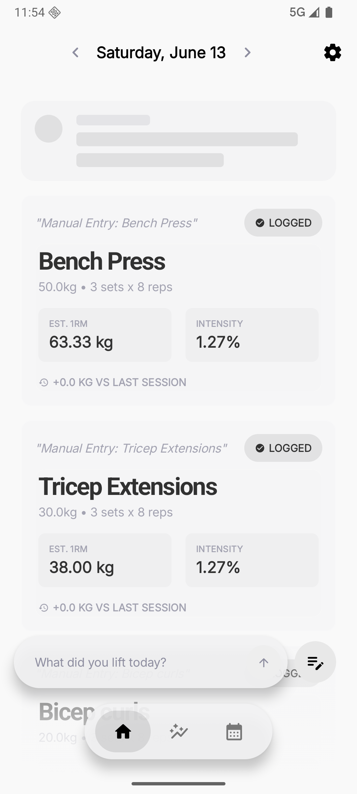
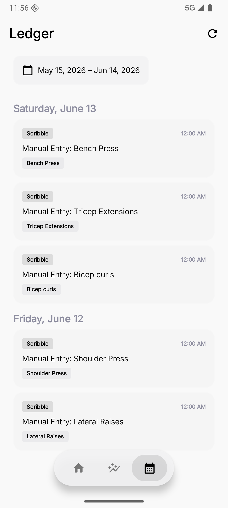
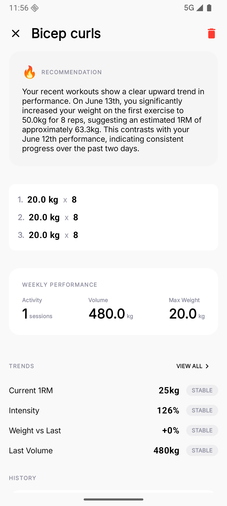
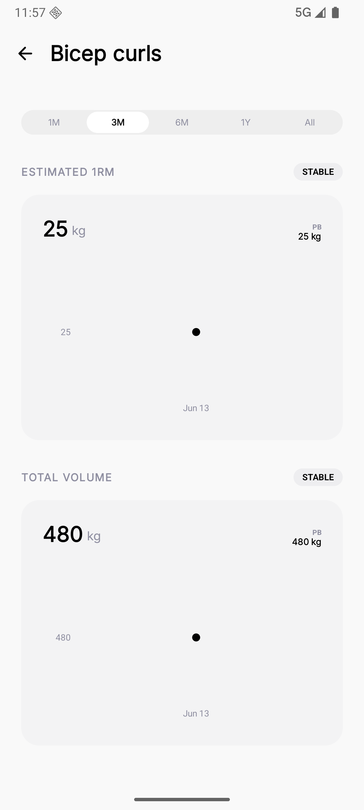
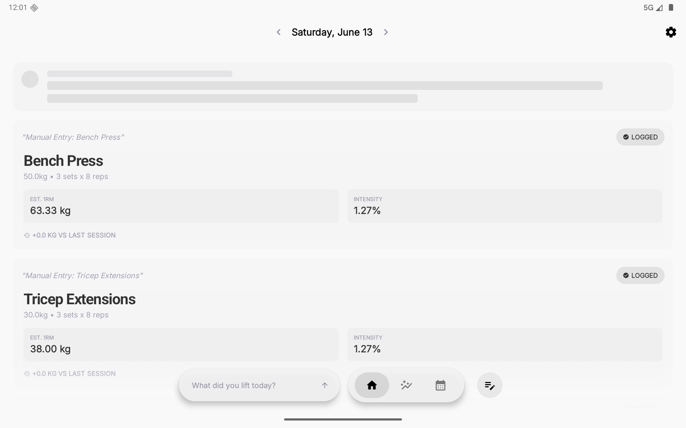
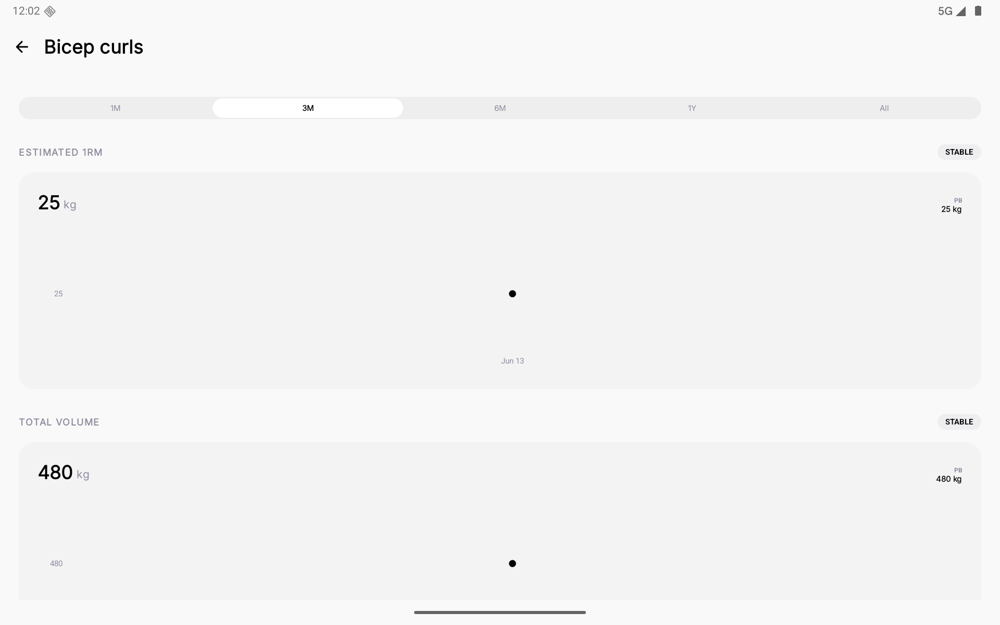

# ScribbleFit

A cross-platform fitness tracking app that turns freeform text scribbles into structured training data using AI. Built natively for Android and iOS with an offline-first, editorial minimalist design.

## Screenshots

<p align="center">
  
  
  
  
</p>

<p align="center">
  
  
</p>

## Core Concept
ScribbleFit lets users jot down sessions in natural language (e.g., "bench press 3x10 80kg"). An LLM parses the text into structured exercises, sets, and reps -- no forms, no dropdowns. The interface is designed to feel like a premium physical journal.

## Key Features
- **Canvas** -- Home screen for session entry via freeform text scribbles, parsed by AI into structured data.
- **Ledger** -- Scrollable training history with date summaries and exercise details.
- **Insights** -- AI-driven analytics, volume tracking, and personalized coaching feedback.
- **Offline-First** -- All data is stored locally first, ensuring a smooth experience even without a connection.
- **Privacy-Centric** -- Minimal data collection, with options for fully local LLM processing.

## Architecture (MVI)
The project follows a strict Model-View-Intent architecture on both platforms, ensuring separation of concerns and reactive data flow.

### Layers
1. **Domain** -- Business models and Use Cases (No dependencies).
2. **Data** -- Repository implementations, persistence (Room/SwiftData), and AI integration.
3. **UI** -- Jetpack Compose (Android) and SwiftUI (iOS) implementations.

## Getting Started

### Android
1. Open `apps/android` in Android Studio.
2. Add your Gemini API Key to `local.properties` as `GEMINI_API_KEY=your_key`.
3. Build and Run.

### iOS
1. Open `apps/ios/ScribbleFit` in Xcode 15+.
2. Configure your development team for signing.
3. Add your Gemini API Key to `LocalPackages/Core/Config/Data/Resources/Secrets.plist`.
4. Build and Run.

## Project Structure
```
.
├── apps/
│   ├── android/       # Jetpack Compose App
│   └── ios/           # SwiftUI App
├── guidelines/        # Shared engineering standards
├── specs/             # Feature specifications
└── GEMINI.md          # Project overview for AI agents
```

## AI Parsing
ScribbleFit uses Google's Gemini models (Flash/Pro) for high-speed, accurate parsing of natural language scribbles into the standard project schema.

## License
MIT
